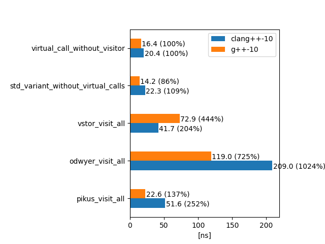

# Benchmark
Runtime overhead for the following implementations was tested:

###Competitors:

- BASELINE: a pure **virtual call** via a base class pointer
  - no visitor pattern at all 
  - instance allocated on the heap as a ```unique_ptr```, which in practice is the simplest and the most common rival to
  using the visitor pattern in the first place.
- Visitor pattern ```vstor```
  - uses double dispatch: first virtual, then ```std::variant``` based
- Visitor pattern by **Fedor Pikus**: https://github.com/PacktPublishing/Hands-On-Design-Patterns-with-CPP/blob/master/Chapter18/04b_visitor_template.C
    - uses double virtual dispatch: first on the visitable, second on the visitor
- Visitor pattern by  **Arthur O’Dwyer**: https://quuxplusone.github.io/blog/2020/09/29/oop-visit/
    - uses sequential typeid comparison
- **std::variant**
    - uses single runtime dispatch (non-virtual based)
  
### Used compilers:
- gcc-10
- clang-10

###Scenario:
A class hierarchy of 1 pure virtual base class and 10 derived classes is defined,
and every derived class is pushed to a ```std::vector```. Next, the vector is shuffled.
We then iterate over all the instances and use each of the calling strategies mentioned 
above to compute a value for the given instance.

The following pseudo-c++ shows the scenario:
```c++
std::vector</*some variant, or a pointer to an abstract base class*/> objects{};
shuffle(objects);
for (auto _ : benchmark_state){
    for (auto& visitable : objects){
        /* visit the visitable with the tested strategy */
        /* to just return a hard-coded int based on the type */
    }
}
```

The specific benchmark case implementation depends on what api is required by the competing
implementation, so see [benchmark.cpp](path to) for details.

###Results:

A simple virtual call is taken as the benchmark base, separated for clang and gcc. The results are
not meant to be precise, but rather present a general trend.

The absolute numbers are not important. It's the relative performance that should be analyzed.




```vstor``` internally uses a virtual dispatch and a ```std::visit``` based visitation. 

**In case of clang**, ```vstor``` usage cost is roughly equivalent to the sum of its pieces, 
i.e. a virtual call + ```std::visit```. Fedor Pikus's implementation, which does virtual 
dispatch twice, performs worse than ```vstor```, and surprisingly worse than 2x the cost of 
a virtual call. Arthur O'Dwyer's implementation of linear ```typeid``` checking is on average 
almost 11x more expensive than a simple virtual call.

**In case of gcc**, ```vstor``` usage cost is around 4.5x times higher than a simple virtual call,
which is somewhat unexpected. Fedor Pikus's implementation performs much better, with 2 consecutive 
virtual method calls being faster than just a single virtual call performed twice. 
Arthur O'Dwyer's implementation is still the slowest, but performs better with gcc than clang.

In this concrete scenario, a raw ```std::variant``` visitation performs roughly as well as a virtual method call of a 
heap-allocated instance. Important to note, that the actual computation is just returning an int. 
In case of a more complicated logic, inlining capabilities might influence the results in favor 
of ```std::visit```.

###Conclusions:
- the runtime cost of ```vstor``` usage would depend on the actual context:
  - one should be cautious when using in a hot loop
  - probably negligible when the actual logic is more complex
- the runtime cost of Fedor Pikus's implementation is probably more stable on different compilers
- the runtime cost of Arthur O'Dwyer's implementation should probably be taken into account in hot loops
- as always, **when in doubt, profile your code!**
 


 

