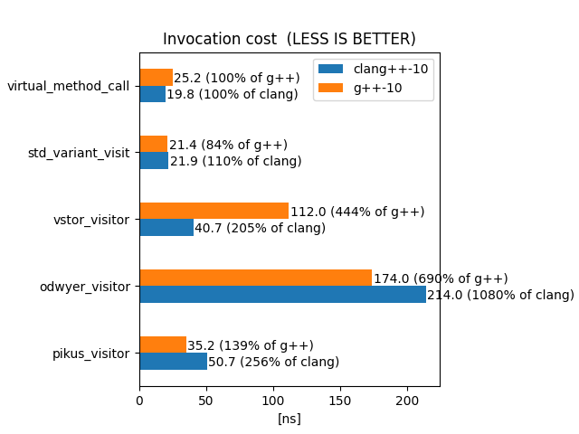

##### example.cpp
```
#include "derived1.hpp"
#include "user1.hpp"
#include "user2.hpp"
#include "user3.hpp"

int main()
{
    Derived1 derived{};
    auto user1_result = user1_value_by_visitation(derived);
    auto user2_result = user2_value_by_virtual_calls(derived);
    auto user3_result = user3_value_by_visitation(derived);
    return 0;
}

```
# Benchmark
Runtime overhead for the following implementations was tested:

###Competitors:

- BASELINE: a pure **virtual call** via a base class pointer
  - no visitor pattern at all 
  - instance allocated on the heap as a ```unique_ptr```, which in practice is the simplest and the most common rival to
  using the visitor pattern in the first place.
- Visitor pattern ```vstor```
  - uses double dispatch: first virtual, then ```std::variant``` based
- Visitor pattern by **Fedor Pikus**: https://github.com/PacktPublishing/Hands-On-Design-Patterns-with-CPP/blob/master/Chapter18/04b_visitor_template.C
    - uses double virtual dispatch: first on the visitable, second on the visitor
- Visitor pattern by  **Arthur O’Dwyer**: https://quuxplusone.github.io/blog/2020/09/29/oop-visit/
    - uses sequential typeid comparison
- **std::variant**
    - uses single runtime dispatch (non-virtual based)
  
### Used compilers:
- gcc-10
- clang-10

###Scenario:
A class hierarchy of 1 pure virtual base class and 10 derived classes is defined,
and every derived class is pushed to a ```std::vector```. Next, the vector is shuffled.
We then iterate over all the instances and use each of the calling strategies mentioned 
above to compute a value for the given instance.

The following pseudo-c++ shows the scenario:
```c++
std::vector</*some variant, or a pointer to an abstract base class*/> objects{};
shuffle(objects);
for (auto _ : benchmark_state){
    for (auto& visitable : objects){
        /* visit the visitable with the tested strategy */
    }
}
```

The specific benchmark case implementation depends on what api is required by the competing
implementation, so see [benchmark.cpp](path to) for details.

##Results:

A simple virtual call is taken as the benchmark base, separated for clang and gcc. The results are
not meant to be precise, but rather present a general trend.

The absolute numbers are not important. It's the relative performance that should be analyzed.




######clang results:
```vstor``` internally uses a virtual dispach and a ```std::visit``` based visitation.

